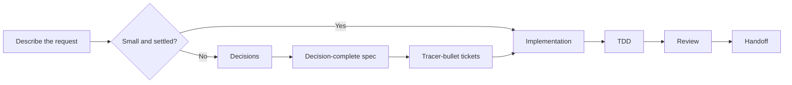
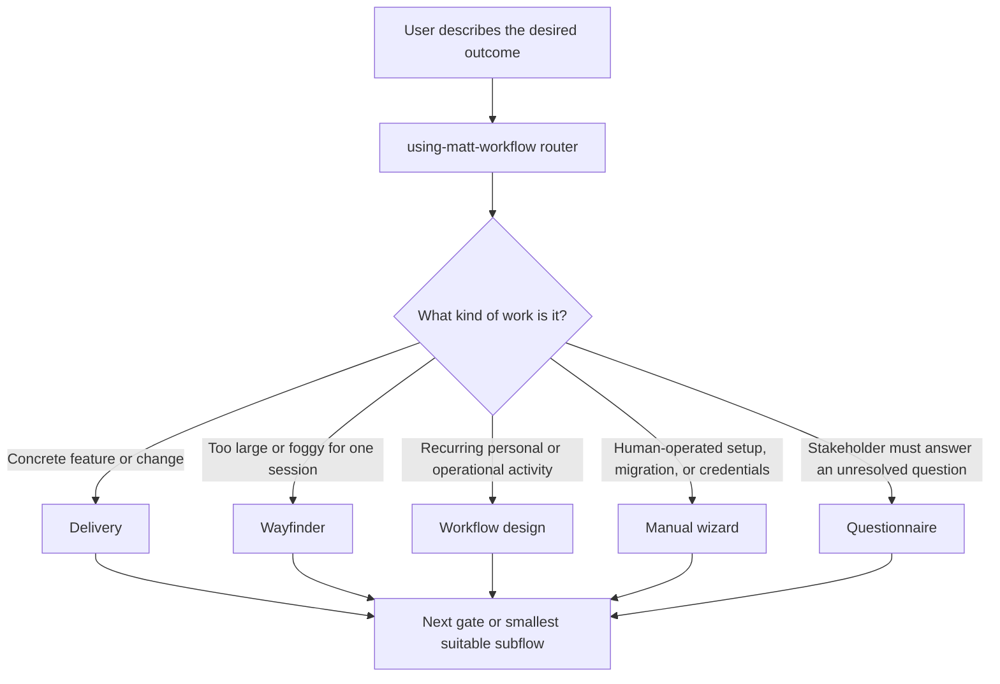
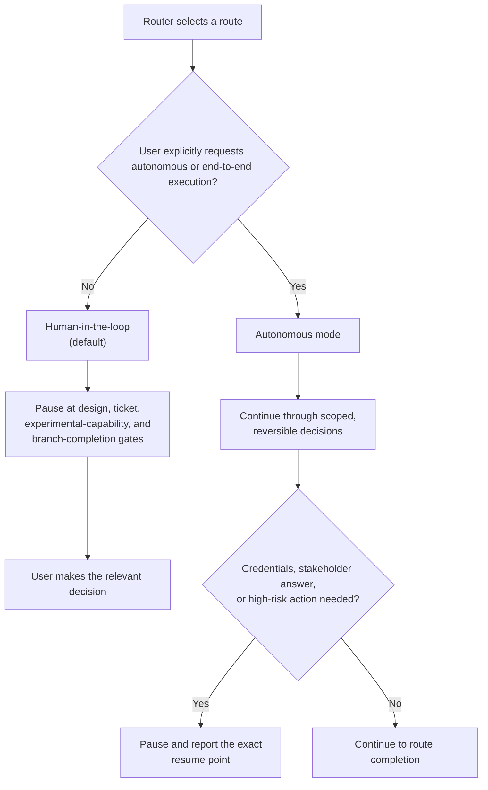

# Matt Workflow

Matt Workflow is a software-delivery plugin for coding agents. It combines selected [Matt Pocock skills](https://github.com/mattpocock/skills) with [Superpowers worktree discipline](https://github.com/obra/superpowers) to take work from an unclear request to a tested, reviewed, handoff-ready change while keeping human decisions visible.

## Workflow



The `using-matt-workflow` skill is the router. It chooses the smallest route that fits:

- **Delivery** — a concrete feature or engineering change.
- **Wayfinder** — an effort too large or foggy for one session.
- **Workflow design** — a recurring personal or operational process.
- **Manual wizard** — a human-operated setup, migration, or credential procedure.
- **Questionnaire** — an unresolved question that needs a specific stakeholder's answer.

Small, settled requests go directly to implementation. Larger or foggier work is shaped through decisions, a decision-complete spec, and independently implementable tickets before code is written.



### Control modes

Human-in-the-loop is the default. The workflow pauses at design, ticket, experimental-capability, and branch-completion gates for the relevant user decision.

Autonomous mode is available only when the user explicitly asks to run the workflow autonomously or end to end. The agent may then make scoped, reversible decisions, but still pauses for unavailable credentials, stakeholder answers, or authority for irreversible or high-risk external actions.



Plan Mode is read-only: it can inspect the repository and present proposed artifacts, but it does not write files, apply patches, or change external state.

At the start of a routed workflow, the router reports:

```text
Route: delivery | wayfinder | workflow-design | manual-wizard | questionnaire
Experimental capability: <name or none>
Next gate: <decision required>
Writes: <anticipated artifacts or none>
```

## Install

Install directly from GitHub through your agent's native marketplace or the generic `skills` CLI. A checkout is not required.

```text
https://github.com/OlivierFortier/mattpocock-superpowers
```

The plugin name is `matt-workflow`, and the current package version is `0.1.0`.

### Codex CLI or ChatGPT desktop

See the [Codex plugin documentation](https://learn.chatgpt.com/docs/build-plugins).

Add the repository marketplace:

```bash
codex plugin marketplace add OlivierFortier/mattpocock-superpowers
codex plugin marketplace list
```

Open Codex's plugin browser, select `matt-workflow`, and install it:

```text
codex
/plugins
```

Start a new session after installation so Codex discovers the bundled skills. In the ChatGPT desktop app, select the same repository marketplace from Plugins while using Codex.

### Claude Code

See [Discover and install Claude Code plugins](https://code.claude.com/docs/en/discover-plugins).

Inside Claude Code, add the repository marketplace, install the plugin, then reload it:

```text
/plugin marketplace add OlivierFortier/mattpocock-superpowers
/plugin install matt-workflow@matt-workflow-marketplace
/reload-plugins
```

Invoke the router as `/matt-workflow:using-matt-workflow`. Other skills use the same plugin namespace, for example `/matt-workflow:grilling`.

For local development or testing, load the checkout directly:

```bash
claude --plugin-dir .
```

### GitHub Copilot CLI

See [Finding and installing plugins for GitHub Copilot CLI](https://docs.github.com/en/copilot/how-tos/copilot-cli/customize-copilot/plugins-finding-installing).

Register the repository marketplace, then install the plugin:

```bash
copilot plugin marketplace add OlivierFortier/mattpocock-superpowers
copilot plugin install matt-workflow@matt-workflow-marketplace
copilot plugin list
```

Use the `matt-workflow` agent/router or invoke a qualified skill such as:

```text
/matt-workflow/using-matt-workflow
/matt-workflow/grilling
```

For local development or testing, install the root package directly:

```bash
copilot plugin install .
```

### OpenCode

Add the git-backed package to `opencode.json`:

```json
{
  "plugin": [
    "matt-workflow@git+https://github.com/OlivierFortier/mattpocock-superpowers.git"
  ]
}
```

Restart OpenCode, then use the `matt_workflow_skill` tool to list or load a skill.
For local development, use `{"plugin":["."]}` from the checkout; see [`.opencode/INSTALL.md`](./.opencode/INSTALL.md).

### Pi

Install the repository as a Pi package:

```bash
pi install git:github.com/OlivierFortier/mattpocock-superpowers
```

For local development, load the checkout temporarily:

```bash
pi -e .
```

### Generic agent skills

The shared workflow is packaged as standard `SKILL.md` files. Vercel's [`skills` CLI](https://skills.sh/docs/cli) fetches the public GitHub repository and installs the skills globally:

```bash
npx skills add OlivierFortier/mattpocock-superpowers
```

Use `npx skills add <source> --skill <name>` to install one workflow skill. The repository's plugin-specific adapters remain available through the native plugin flows above.

## Use it

After installation, describe the outcome you want:

```text
Route this feature from idea to implementation.
Help me plan this large, foggy project.
Turn this recurring process into a workflow.
```

The router selects the route and reports the next gate. You can also request a specific subflow:

```text
Use grilling to stress-test this design one question at a time.
Turn our current conversation into a decision-complete spec.
Split this spec into tracer-bullet tickets.
Review the current diff against the approved spec.
```

## Skills

### Routing and delivery lifecycle

| Skill | Purpose |
| --- | --- |
| `using-matt-workflow` | Classify work and route it through the smallest suitable workflow. This is the only implicit router. |
| `using-git-worktrees` | Create or reuse an isolated Git worktree for implementation. |
| `finishing-a-development-branch` | Safely finish and integrate a development branch. |

### Discovery and design

| Skill | Purpose |
| --- | --- |
| `grilling` | Stress-test thinking one question at a time. |
| `grill-with-docs` | Grill a design and write the resulting design documents. |
| `domain-modeling` | Build and sharpen the project's domain model. |
| `research` | Research a question from high-trust sources using a background agent. |
| `prototype` | Build a cheap prototype to answer a design question. |
| `wayfinder` | Map a large or foggy effort as decision tickets. |
| `batch-grill-me` | Interview several independent decision fronts in batches. **Experimental.** |

### Planning and coordination

| Skill | Purpose |
| --- | --- |
| `to-spec` | Turn the current conversation and repository understanding into a spec. |
| `to-tickets` | Split a spec into independently implementable tracer-bullet tickets. |
| `to-questionnaire` | Turn an unresolved stakeholder decision into an async questionnaire. **Experimental.** |
| `handoff` | Compact the current conversation into a handoff for a fresh agent. |

### Implementation and verification

| Skill | Purpose |
| --- | --- |
| `implement` | Build work described by an approved spec or tickets. |
| `tdd` | Drive behavior changes through test-driven red-green-refactor. |
| `code-review` | Review a diff for specification compliance and code quality. |

### Setup and recurring workflows

| Skill | Purpose |
| --- | --- |
| `setup-matt-pocock-skills` | Configure a repository for the workflow skills and local conventions. |
| `loop-me` | Specify a recurring workflow as a durable workflow document. **Experimental.** |
| `wizard` | Generate a human-operated setup or migration wizard. **Experimental.** |

Experimental skills are opt-in and must be announced before use. A wizard is returned for the human to execute; it is never executed automatically.

## What the plugin changes

Matt Workflow provides:

- Shared workflow skills under `skills/`.
- A Codex plugin manifest at `.codex-plugin/plugin.json`.
- A Claude Code plugin manifest at `.claude-plugin/plugin.json`.
- A Copilot plugin manifest at `plugin.json` and router agent under `agents/`.
- An OpenCode adapter under `.opencode/plugins/`.
- Pi package metadata in the root `package.json`.

It does not add MCP servers, connectors, apps, or lifecycle hooks. The host's permissions, sandbox, approval policy, authentication, and external integrations still apply.

## Develop and verify

This repository is a packaging and adaptation project. It is not a product application.

Install dependencies and run the complete check:

```bash
npm install
npm test
```

The test checks plugin structure, host manifests, skill metadata, the OpenCode loader, pinned upstream revisions, and vendored-skill consistency.

Useful commands:

```bash
npm run sync:check  # verify generated skills match the pinned upstreams
npm run sync        # regenerate vendored skills from the pinned upstreams
```

The files under `skills/` are generated, adapted upstream skills. Do not hand-edit those copies for durable changes. Update the synchronization transformation or the pinned upstream inputs intentionally, then regenerate and run `npm test`.

## Attribution and license

Matt Workflow is released under the [MIT License](./LICENSE).

The plugin vendors and adapts selected material from:

- [Matt Pocock's skills](https://github.com/mattpocock/skills), pinned at commit `9603c1cc8118d08bc1b3bf34cf714f62178dea3b`.
- [Superpowers](https://github.com/obra/superpowers), pinned to v6.1.1 commit `d884ae04edebef577e82ff7c4e143debd0bbec99`.

See [THIRD_PARTY_NOTICES.md](./THIRD_PARTY_NOTICES.md) and the copied license texts under `third-party/` for the complete notices.
